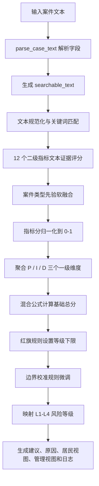

# 风险规则流程说明

本文档说明 `risk_data` 工作区内当前规则型风险预测系统的执行流程，并记录本轮自测结果。

## 1. 系统边界

当前风险预测系统以单条矛盾纠纷文本为输入，输出风险等级、风险分数、P/I/D 三类维度分、触发规则、处置建议和解释文本。

核心文件职责如下：

| 文件 | 职责 |
| --- | --- |
| `risk_matching.py` | 文本字段解析、关键词匹配、别名匹配、模糊匹配、否定词处理、案件类型识别 |
| `risk_config.py` | 风险等级阈值、处置建议、公式权重、先验融合权重、12 个二级指标及锚点配置 |
| `risk_engine.py` | 指标评分、案件类型先验融合、P/I/D 聚合、总分计算、红旗规则、边界校准、输出解释 |
| `risk_scoring.py` | 对外统一入口，兼容模块调用和命令行调用 |
| `run_algorithm_test.py` | 离线验证脚本，生成预测明细、指标、错误样本、混淆矩阵和测试报告 |

## 2. 规则执行总流程



## 3. 输入解析

入口函数为 `risk_scoring.assess_case(text)`，实际实现位于 `risk_engine.assess_case`。

系统先调用 `parse_case_text(text)` 解析以下字段：

| 字段 | 来源 |
| --- | --- |
| `case_type` | `案件类型`、`类型`、`案由` 等标签行 |
| `title` | `案件标题`、`标题`、`案件名称` 等标签行 |
| `description` | `案件描述`、`案情`、`描述`、`基本情况` 等标签行 |
| `raw_text` | 原始输入全文 |

后续匹配优先使用 `title + description` 组成的 `searchable_text`；如果二者为空，则回退使用 `raw_text`。

## 4. 文本匹配规则

匹配层主要由 `risk_matching.py` 提供：

1. 使用 Unicode NFKC 归一化，并移除标点、空白和符号，降低格式差异影响。
2. 每个关键词会展开同义词或别名，例如报警、聚集、欠薪、工伤等场景词。
3. 对长度足够的关键词启用相似度模糊匹配，降低轻微错字或表述变化带来的漏判。
4. 对直接命中的词检查前置否定窗口，避免“没有报警”“未发生伤害”等文本被误判为风险信号。
5. 案件类型同样支持别名匹配，用于后续先验融合。

## 5. 指标体系

系统采用 P/I/D 三个一级维度和 12 个二级指标。

| 一级维度 | 二级指标 |
| --- | --- |
| P：升级概率 | 冲突强度、持续性/复发性、涉事主体复杂度、升级触发信号 |
| I：影响后果 | 影响范围、安全/健康损害、经济/民生损失、公共秩序/舆情影响 |
| D：处置难度 | 法律与事实争议度、跨部门协调难度、调解资源与时效压力、弱势群体/紧迫性 |

每个二级指标在 `PATTERN_RULES` 中配置 1-5 档关键词。文本命中后，系统取最强命中档位作为基础分，并根据命中词数量和命中层级丰富度增加小幅 bonus，得到连续分。

## 6. 案件类型先验融合

案件类型不直接决定最终等级，而是作为弱先验修正二级指标分。

融合逻辑：

| 文本证据数量 | 案件类型先验权重 |
| ---: | ---: |
| 0 | 0.55 |
| 1 | 0.30 |
| 2 个及以上 | 0.18 |

含义是：文本证据越弱，案件类型先验影响越大；文本证据越强，最终结果越依赖实际案情。

## 7. P/I/D 聚合与总分公式

每个二级指标先归一化到 `[0, 1]`：

```text
normalized = (clipped_score - 1) / 4
```

随后按 `risk_config.py` 中的 `SECONDARY_WEIGHTS` 聚合得到 P/I/D。

总分使用混合公式：

```text
raw_total = 0.10 * P * I + 0.30 * P + 0.40 * I + 0.20 * D
raw_score = 100 * raw_total
calibrated_score = raw_score * 2.0 + 20.0
```

最终分数限制在 `0-100`。

## 8. 红旗规则与边界校准

总分计算后会先进入红旗规则：

| 触发类型 | 处理 |
| --- | --- |
| 人身伤害、暴力风险、公共安全隐患、聚集或舆情扩散中任一类命中 | 总分最低提升到 `56`，即至少 L3 |
| 公安/司法介入，或多个 L3 红旗叠加 | 总分最低提升到 `81`，即至少 L4 |

之后进入边界校准：

1. 对轻微邻里类纠纷启用低风险边界保护，减少 L1 被高估。
2. 对没有红旗且缺少强升级信号的 L2/L3 边界样本做降噪，减少一般风险误判为较高风险。
3. 对健康损害、排放超标、公共设施长期不可用等明确补偿场景补足 L3。

## 9. 风险等级映射

| 等级 | 分数区间 | 处置含义 |
| --- | ---: | --- |
| L1 | 0-26 | 网格员或物业自行处置，保留回访 |
| L2 | 27-52 | 调解员介入，组织协商并设置跟踪节点 |
| L3 | 53-80 | 街道或相关部门联合处置，提前做好稳控与预案 |
| L4 | 81-100 | 立即升级至公安、法院或应急体系联动处置 |

## 10. 输出内容

`RiskAssessment` 输出包含：

| 字段 | 说明 |
| --- | --- |
| `risk_score` | 0-100 风险总分 |
| `risk_level` | L1-L4 风险等级 |
| `P` / `I` / `D` | 三个一级维度分 |
| `trigger_flags` | 命中的红旗规则 |
| `recommendation` | 等级对应的处置建议 |
| `reason_text` | 面向复核人员的解释文本 |
| `indicators` | 12 个二级指标的分数、锚点和证据 |
| `views` | 居民视图和管理视图 |

命令行入口会额外把详细 JSON 日志写入 `risk_data/logs/risk_assessment_*.json`。

## 11. 本轮自测结果

本轮测试时间：2026-05-21。

已执行命令：

```powershell
python -m compileall risk_data tests
python risk_data/run_algorithm_test.py
python tests/debug_full.py
python tests/debug_matching.py
python -m risk_data.risk_scoring --text "案件类型：劳动争议\n案情：农民工工伤后急需赔偿，多次协商无果，并扬言聚集维权。" --pretty
```

离线验证集结果：

| 指标 | 结果 |
| --- | ---: |
| 样本总数 | 26 |
| 预测正确 | 22 |
| 预测错误 | 4 |
| Accuracy | 0.8462 |
| Weighted F1 | 0.8381 |
| Score Range Hit Rate | 0.8462 |
| 高估样本 | 4 |
| 低估样本 | 0 |

混淆矩阵：

| actual\predicted | L1 | L2 | L3 | L4 |
| --- | ---: | ---: | ---: | ---: |
| L1 | 4 | 2 | 1 | 0 |
| L2 | 0 | 12 | 1 | 0 |
| L3 | 0 | 0 | 6 | 0 |
| L4 | 0 | 0 | 0 | 0 |

主要剩余风险：

1. 验证集只有 26 条，样本规模偏小。
2. 当前验证集中没有真实 L4 样本，无法充分评估最高风险场景召回能力。
3. 4 条错误样本全部为高估，后续优化应重点复核 L1/L2 边界、弱文本先验和物业/环境/调解类场景。
